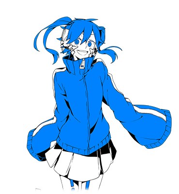

  

<h1 align="center">Ene</h1>

A go bot framework

### Summary
Ene is a twitch bot that functions as plugin framework for making fun chatbot plugins

### Features
Ene is divided into three parts:
* `/cmd/`: The core bot engine
* `/internal/adapters/`: Service Input and Output
* `/internal/plugins/`: dynamic logic for handling input

### Goals

* adapters
  - [ ] cli
  - [ ] twitch
  - [ ] openai
  - [ ] discord
  - [ ] opera.gx
  - [ ] twitter
  - [ ] tts
* plugins
  - [ ] trivia
  - [ ] spam
  - [ ] quotes
  - [ ] tarot
  - [ ] gpt
  - [ ] mahjong
  - [ ] chinese dictionary
* lib 
  - [ ] database
  - [ ] chatgpt
  - [ ] emotes
    - [ ] ffz
    - [ ] bttv
    - [ ] 7tv